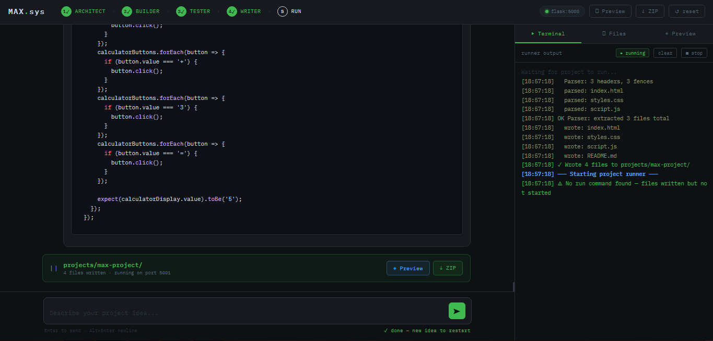

# MAX.sys

> **Idea → Architecture → Code → Tests → Docs → Running App**
> A multi-agent AI pipeline that takes a plain-English project idea all the way to a running, downloadable codebase — with human approval gates at every critical step.

---

## Interface Preview

<p align="center">
  
</p>

---


## What It Does

You type an idea. MAX.sys does the rest:

```
You: "build a todo app with local storage"
        │
        ▼
  ┌─────────────┐
  │  ARCHITECT  │  Designs the full system — folder structure,
  │             │  tech stack, module breakdown, API design
  └──────┬──────┘
         │  ✋ You review & approve (or request changes)
         ▼
  ┌─────────────┐
  │   BUILDER   │  Writes every file from the architecture doc.
  │             │  Production-ready code, no placeholders.
  └──────┬──────┘
         │  ✋ You review & approve (or request changes)
         ▼
  ┌───────────┐   ┌──────────┐   ┌──────────────┐
  │  TESTER   │ → │  WRITER  │ → │    RUNNER    │
  │ bug report│   │ README.md│   │ serve/proxy  │
  └───────────┘   └──────────┘   └──────────────┘
         │                              │
         └──────── auto, no gates ──────┘
                          │
                   ✓ Files on disk
                   ✓ Live preview in browser
                   ✓ ZIP download
```

---

## Features

- **4 specialized AI agents** — Architect, Builder, Tester, Writer, each with a single focused job
- **Human-in-the-loop approval gates** after Architect and Builder — approve or iterate as many times as you need
- **Smart intent detection** — type naturally; the backend classifies your message as APPROVE or IMPROVE automatically, no special commands
- **Automatic file writing** — parses the builder's output and writes every file to `projects/<name>/` on disk
- **Smart project type detection** — detects Static, Flask, Node, or Other from the written files automatically
- **Universal preview** — every project type served through MAX's own server, no guessing ports:
  - Static HTML/JS/CSS → served directly at `/preview/<name>/`
  - Flask / FastAPI / Node → reverse-proxied at `/proxy/<name>/`
- **Live terminal** — real-time subprocess output streamed to the browser via Server-Sent Events
- **File explorer** — browse and syntax-highlight every written file in the UI
- **ZIP download** — download the entire project as a `.zip` in one click
- **Robust file parser** — handles 6+ LLM output formats with multi-pattern regex and an automatic fallback mode
- **Debug endpoint** — `GET /debug/parse` shows exactly what the parser extracted if something looks wrong

---

## Agents

| Agent | Job | Gate |
|---|---|---|
| **ARCHITECT** | Complete architecture doc — tech stack, folder tree, module breakdown, API design, implementation notes, and run metadata (`PROJECT_NAME`, `RUN_COMMAND`, `INSTALL_COMMAND`, `PORT`) | ✅ User approves |
| **BUILDER** | Implements every file from the architecture doc. Full production-quality code, no stubs or TODOs | ✅ User approves |
| **TESTER** | Static analysis, bug report table, fixed code for critical issues, unit test cases, quality score 1–10 | ❌ Auto |
| **WRITER** | Generates a complete `README.md` from the architecture, code, and test report | ❌ Auto |

---

## Preview — How It Works

MAX.sys never hardcodes a port in the browser. It detects the project type and routes the preview through its own server at `localhost:5000`:

| Detected type | How detected | Served at |
|---|---|---|
| `static` | Has `.html` files or only web-safe extensions | `/preview/<name>/` directly |
| `flask` | A `.py` file imports flask / fastapi / uvicorn | `/proxy/<name>/` → reverse-proxied to subprocess |
| `node` | `package.json` exists | `/proxy/<name>/` → reverse-proxied to subprocess |
| `other` | Python with no web framework | Subprocess runs, no iframe preview |

The iframe always points to a MAX-hosted URL — it works regardless of what port the generated app binds to internally.

---

## Tech Stack

| Layer | Technology |
|---|---|
| LLM API | [Groq](https://console.groq.com/) |
| Models | `meta-llama/llama-4-scout-17b-16e-instruct` and  `groq/compound`  |
| Backend | Python · Flask · Flask-CORS |
| Frontend | Vanilla HTML / CSS / JS — single file, zero build step |
| Markdown rendering | [marked.js](https://marked.js.org/) |
| Syntax highlighting | [highlight.js](https://highlightjs.org/) |
| Config | python-dotenv |

---

## Prerequisites

- Python **3.8+**
- A [Groq API key](https://console.groq.com/keys) — free tier is sufficient
- `pip`

---

## Installation

**1. Clone the repository**

```bash
git clone https://github.com/Samin-Saikia/MAX.sys-Multi-Agent-Software-Builder
```

**2. Install Python dependencies**

```bash
pip install flask flask-cors groq python-dotenv
```

**3. Configure your API key**

```bash
cp .env.example .env
```

Open `.env` and add your key:

```env
GROQ_API_KEY=your_groq_api_key_here
```

**4. Start the server**

```bash
python app.py
```

**5. Open the UI**

```
http://localhost:5000
```

---

## Usage

### Describe a project

Type your idea into the input field and press **Enter**.

```
a REST API for a task manager with user auth and SQLite
```
```
vanilla JS pomodoro timer, no frameworks, clean UI
```
```
flask dashboard showing live CPU and memory usage with charts
```

### At an approval gate

After the Architect or Builder responds, an approval bar appears:

- **✓ Approve** — advance to the next stage
- **✏ Improve** (or just type) — send feedback for a revision

```bash
# Architecture gate examples
"use PostgreSQL instead of SQLite"
"add a WebSocket endpoint for live updates"
"split auth into a separate blueprint"

# Build gate examples
"the login route is missing input validation"
"add a requirements.txt"
"the CSS file is empty, fill it in"
```

You can iterate as many times as needed at each gate. Only when you approve does the pipeline advance.

### After you approve the build

The pipeline runs the remaining steps automatically:

1. **Tester** reviews the code and produces a bug report + test cases
2. **Writer** generates the project `README.md`
3. All files are written to `projects/<name>/`
4. The project is started (server apps) or served directly (static apps)
5. The preview iframe loads in the right panel
6. The ZIP is ready to download

### Right panel

| Tab | Contents |
|---|---|
| **▶ Terminal** | Live subprocess output — install logs, server startup, runtime errors |
| **⬡ Files** | File tree with syntax-highlighted viewer for every written file |
| **◈ Preview** | Embedded live preview of the running app |

---

## Project Structure

```
max-sys/
├── app.py          # Flask backend — pipeline state machine, agents,
│                   # file parser, runner, preview/proxy routes
├── index.html      # Frontend — single HTML file, no build step
├── projects/       # Generated projects written here (auto-created)
│   └── <name>/     # One subfolder per built project
├── .env            # Groq API key (never commit this)
├── .env.example    # Key template
└── README.md       # This file
```

---

## API Reference

### `POST /chat`
Main pipeline endpoint. Accepts user messages and advances the state machine.

**Request**
```json
{ "message": "build a weather app using the open-meteo API" }
```

**Response**
```json
{
  "stage":       "await_arch_approval",
  "agent":       "ARCHITECT",
  "message":     "...",
  "waiting_for": "approval",
  "pipeline_status": { "arch": true, "build": false, "test": false, "write": false },
  "project":     { "name": "", "port": null }
}
```

---

### `GET /logs`
Server-Sent Events stream of live subprocess output. Consumed by the terminal panel.

---

### `GET /files`
Returns all files in the current project folder with paths, contents, and sizes.

---

### `GET /download`
Streams the current project folder as a `.zip` attachment.

---

### `GET /preview/<name>/` · `GET /preview/<name>/<path>`
Serves static project files directly from `projects/<name>/`. Used for HTML/JS/CSS projects.

---

### `GET /proxy/<name>/` · `GET /proxy/<name>/<path>`
Reverse-proxies requests to the running subprocess on its internal port. Used for Flask and Node projects.

---

### `GET /debug/parse`
Returns what the file parser found in the current build output. Useful when a project write looks incomplete.

```json
{
  "build_length":   8432,
  "files_parsed":   ["app.py", "templates/index.html", "requirements.txt"],
  "fences_found":   4,
  "fence_previews": [...],
  "build_preview":  "..."
}
```

---

### `POST /stop`
Terminates the running subprocess. Pipeline state is preserved.

---

### `POST /reset`
Kills any subprocess and wipes all pipeline state back to `idle`. The `projects/` folder is kept on disk.

---

### `GET /state`
Returns the current stage, full conversation history, and pipeline status flags.

---

## Pipeline Stages

| Stage | Description |
|---|---|
| `idle` | Waiting for a project idea |
| `await_arch_approval` | Architecture ready — waiting for user approval or feedback |
| `builder` | Builder is generating code |
| `await_build_approval` | Code ready — waiting for user approval or feedback |
| `tester` | Tester running automatically |
| `writer` | Writer generating README automatically |
| `running` | Files written, subprocess starting |
| `done` | Pipeline complete — type a new idea to restart |

---

## Environment Variables

| Variable | Required | Description |
|---|---|---|
| `GROQ_API_KEY` | ✅ | From [console.groq.com/keys](https://console.groq.com/keys) |

---

## Known Limitations

- **Single session** — one active pipeline at a time; designed for solo local use
- **In-memory state** — restarting `app.py` resets the pipeline (the `projects/` folder is preserved on disk)
- **Token cap** — Groq's 4096-token output limit may truncate very large projects; complex apps may require a follow-up build or manual completion
- **Proxy limitations** — the reverse proxy rewrites HTML-embedded URLs but not JS-constructed ones; SPAs with full client-side routing may behave unexpectedly
- **No authentication** — do not expose port 5000 on a public network

---

## Author

**Samin Saikia**

Python Developer focused on backend systems, AI agents, and practical software tools.

- GitHub: https://github.com/Samin-Saikia
- LinkedIn: https://www.linkedin.com/in/samin-saikia-b7660b3a1/

Built as an experimental research project exploring multi-agent software development pipelines.

---


## Contributing

1. Fork the repo
2. Create a branch: `git checkout -b feature/your-feature`
3. Commit: `git commit -m "add: your feature"`
4. Push: `git push origin feature/your-feature`
5. Open a Pull Request

Please keep PRs focused — one feature or fix per PR.

---

## License

MIT — see [LICENSE](LICENSE) for details.

---

<div align="center">
  <strong>MAX.sys</strong> &nbsp;·&nbsp; Groq + Llama 4 Scout &nbsp;·&nbsp; MIT License
</div>