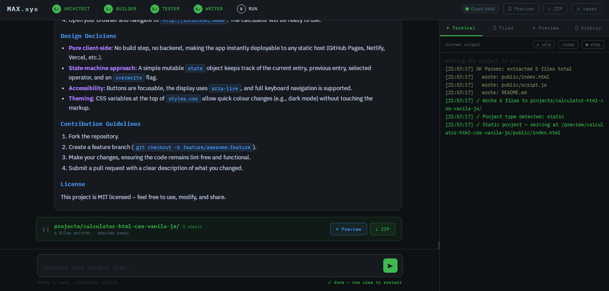
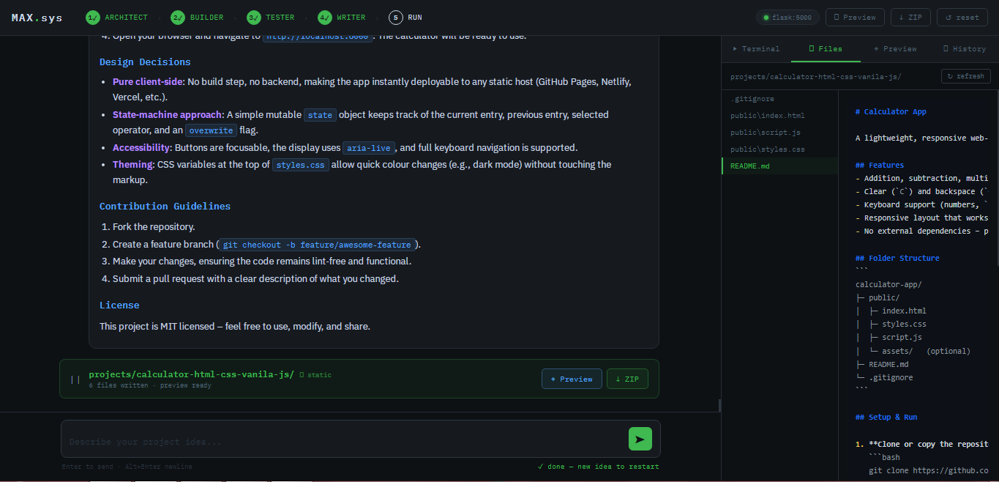
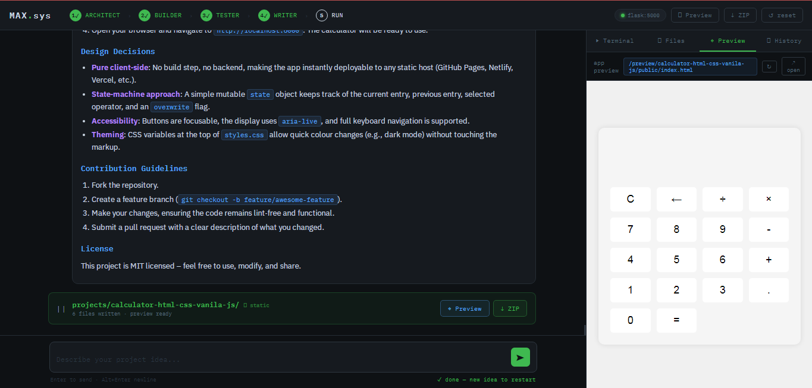

# MAX.sys

> **Idea → Architecture → Code → Tests → Docs → Running App**
> A multi-agent AI pipeline that takes a plain-English project idea all the way to a running, downloadable codebase — with human approval gates at every critical step.

---
## Interface Preview

<p align="center">
terminal
  
  files
  
  preview
  
</p>

---


## What It Does

You type an idea. MAX.sys does the rest:

```
You: "build a task manager with a REST API and SQLite"
        │
        ▼
  ┌─────────────┐
  │  ARCHITECT  │  Full system design — folder structure,
  │             │  tech stack, API design, module breakdown
  └──────┬──────┘
         │  ✋ You review & approve (or request changes)
         ▼
  ┌─────────────┐
  │   BUILDER   │  Writes every file. Production-ready,
  │             │  no placeholders, no TODOs.
  └──────┬──────┘
         │  ✋ You review & approve (or request changes)
         ▼
  ┌───────────┐   ┌──────────┐   ┌──────────────┐
  │  TESTER   │ → │  WRITER  │ → │    RUNNER    │
  │ bug report│   │ README.md│   │ serve/proxy  │
  └───────────┘   └──────────┘   └──────────────┘
         │                              │
         └──────── auto, no gates ──────┘
                          │
                   ✓ Files written to disk
                   ✓ App running & previewed
                   ✓ ZIP ready to download
```

---

## Features

- **4 specialized AI agents** — Architect, Builder, Tester, Writer, each with a focused single job
- **Human approval gates** after Architect and Builder — approve to advance or iterate as many times as needed
- **Smart intent detection** — type naturally; the backend classifies your message as APPROVE or IMPROVE automatically
- **Automatic file writing** — parses the builder's output and writes every file to `projects/<name>/` on disk
- **Smart project type detection** — detects Static, Flask, or Node from the written files
- **Universal preview** — all project types served through MAX's own server at `localhost:5000`:
  - Static HTML/JS/CSS → served directly at `/preview/<name>/`
  - Flask / FastAPI → patched for correct port binding, proxied at `/proxy/<name>/`
  - Node.js → proxied at `/proxy/<name>/`
- **Flask auto-patcher** — fixes common LLM-generated issues before running (wrong port, `debug=True`, missing `app.run`)
- **Live terminal** — real-time subprocess output streamed via SSE
- **File explorer** — browse and syntax-highlight every written file in the UI
- **ZIP download** — download the full project as a `.zip` in one click
- **Session persistence** — pipeline state saved to `session.json` after every step; survives server restarts
- **Project history** — every completed project logged to `history.json` with preview, ZIP, and restore buttons
- **Robust file parser** — handles 6+ LLM output format variations with multi-pattern regex and fallback mode
- **Debug endpoint** — `GET /debug/parse` shows what the parser extracted if a write looks incomplete

---

## Agents

| Agent | Job | Gate |
|---|---|---|
| **ARCHITECT** | Complete architecture doc — tech stack, folder tree, module breakdown, API design, implementation notes, and run metadata (`PROJECT_NAME`, `RUN_COMMAND`, `INSTALL_COMMAND`, `PORT`) | ✅ User approves |
| **BUILDER** | Implements every file from the architecture doc. Full production-quality code, no stubs | ✅ User approves |
| **TESTER** | Static analysis, bug report table (file/issue/severity), fixed code for critical bugs, test cases, quality score 1–10 | ❌ Auto |
| **WRITER** | Generates a complete `README.md` from the architecture, code, and test report | ❌ Auto |

---

## Preview — How It Works

MAX.sys never opens an external port in the browser. All previews are routed through `localhost:5000`:

| Detected type | Detection logic | How previewed |
|---|---|---|
| `static` | Has `.html` files or only web-safe extensions | Served directly at `/preview/<name>/` — instant |
| `flask` | in progress |in progress |
| `node` | in progress | in progress |
| `other` | Python with no web framework (CLI, scripts) | Subprocess runs, no iframe preview |


## Tech Stack

| Layer | Technology |
|---|---|
| LLM API | [Groq](https://console.groq.com/) |
| Models | `meta-llama/llama-4-scout-17b-16e-instruct` and `groq/compound`|
| Backend | Python · Flask · Flask-CORS |
| Frontend | Vanilla HTML / CSS / JS — single file, no build step |
| Markdown | [marked.js](https://marked.js.org/) |
| Syntax highlighting | [highlight.js](https://highlightjs.org/) |
| Config | python-dotenv |

---

## Prerequisites

- Python **3.7+**
- A [Groq API key](https://console.groq.com/keys) — free tier works
- `pip`

---

## Installation

**1. Clone the repository**

```bash
git clone https://github.com/Samin-Saikia/MAX.sys-Multi-Agent-Software-Builder
cd max-sys
```

**2. Install dependencies**

```bash
pip install flask flask-cors groq python-dotenv
```

**3. Set your API key**

```bash
cp .env.example .env
```

Edit `.env`:

```env
GROQ_API_KEY=your_groq_api_key_here
```

**4. Run**

```bash
python app.py
```

**5. Open**

```
http://localhost:5000
```

---

## Usage

### Start a project

Type your idea and press **Enter**:

```
a REST API for a task manager with user auth and SQLite
```
```
vanilla JS pomodoro timer, dark theme, saves to localStorage
```
```
flask dashboard that shows live CPU and memory usage with charts
```

### At an approval gate

After the Architect or Builder responds, an approval bar appears:

- **✓ Approve** — advance to the next stage
- **✏ Improve** (or just type) — send feedback for a revision

```bash
# Architecture gate — example feedback
"use PostgreSQL instead of SQLite"
"add WebSocket support for live updates"
"split the auth module into a separate blueprint"

# Build gate — example feedback
"the login route is missing input validation"
"add a requirements.txt file"
"the CSS is too basic, improve the styling"
```

Iterate as many times as needed. The pipeline only advances when you approve.

### After build approval

1. **Tester** reviews code — bug report + test cases (auto)
2. **Writer** generates `README.md` (auto)
3. Files written to `projects/<name>/`
4. App launched (server projects) or served directly (static)
5. Preview loads in the right panel
6. ZIP ready to download

### Right panel tabs

| Tab | Contents |
|---|---|
| **▶ Terminal** | Live subprocess output — install logs, startup, runtime errors |
| **⬡ Files** | File tree + syntax-highlighted viewer for every written file |
| **◈ Preview** | Live iframe of the running app |
| **◷ History** | All past completed projects — preview, ZIP, or restore |

---

## Project Structure

```
max-sys/
├── app.py          # Flask backend — pipeline, agents, file parser,
│                   # runner, patcher, preview/proxy routes
├── index.html      # Frontend — single HTML file, no build step
├── session.json    # Auto-created — current pipeline state (survives restarts)
├── history.json    # Auto-created — index of all completed projects
├── projects/       # Auto-created — one subfolder per built project
│   └── <name>/
├── .env            # Your Groq API key (never commit this)
├── .env.example    # Key template
└── README.md       # This file
```

---

## API Reference

### `POST /chat`
Main pipeline endpoint. Routes user messages through the state machine.

**Request**
```json
{ "message": "build a weather dashboard using open-meteo API" }
```

**Response**
```json
{
  "stage": "await_arch_approval",
  "agent": "ARCHITECT",
  "message": "...",
  "waiting_for": "approval",
  "pipeline_status": { "arch": true, "build": false, "test": false, "write": false },
  "project": { "name": "", "port": null }
}
```

---

### `GET /logs`
Server-Sent Events stream of live subprocess output. Consumed by the terminal panel.

### `GET /app-status`
Returns whether the subprocess port is currently accepting connections.
```json
{ "ready": true, "port": 5001, "ptype": "flask", "preview": "/proxy/my-app/" }
```

### `GET /files`
All files in the current project folder with paths, contents, and sizes.

### `GET /download` · `GET /download?project=<name>`
Streams the project as a `.zip`. Supports `?project=` to download any past project by name.

### `GET /preview/<name>/` · `GET /preview/<name>/<path>`
Serves static project files directly from disk.

### `GET /proxy/<name>/` · `GET /proxy/<name>/<path>`
Reverse-proxies to the running subprocess. Retries up to 6× with 1s gaps before returning a friendly auto-refresh page.

### `GET /debug/parse`
Shows what the file parser found in the current build output — useful when a project write looks incomplete.

### `GET /history`
Returns the full list of completed past projects.

### `POST /history/<id>/load`
Restores a past project's metadata into the pipeline state.

### `POST /stop`
Terminates the running subprocess. Pipeline state is preserved.

### `POST /reset`
Kills any subprocess and wipes all pipeline state back to `idle`. Deletes `session.json`. The `projects/` folder is kept.

### `GET /state`
Returns current stage, conversation history, and pipeline status flags.

---

## Pipeline Stages

| Stage | Description |
|---|---|
| `idle` | Waiting for a project idea |
| `await_arch_approval` | Architecture ready — waiting for approval or feedback |
| `builder` | Builder generating code |
| `await_build_approval` | Code ready — waiting for approval or feedback |
| `tester` | Tester running (auto) |
| `writer` | Writer generating README (auto) |
| `running` | Files written, subprocess starting |
| `done` | Complete — type a new idea to restart |

---

## Persistence

Two JSON files are created automatically in the project root:

**`session.json`** — written after every state change. On the next `python app.py` startup, the pipeline is restored exactly where it left off. If the server crashed mid-run, the stage drops back to `done` so nothing is lost.

**`history.json`** — one entry appended each time the pipeline completes. Stores project name, type, preview URL, original idea, and timestamp. The **◷ History** tab reads this file.

Running `↺ reset` deletes `session.json` so the next startup begins fresh.

---

## Environment Variables

| Variable | Required | Description |
|---|---|---|
| `GROQ_API_KEY` | ✅ | From [console.groq.com/keys](https://console.groq.com/keys) |

---

## Known Limitations

- **Flask preview latency** — Flask apps need time to install deps and start up. The proxy retries automatically and the terminal shows live progress.
- **Single session** — one active pipeline at a time; designed for solo local use
- **In-memory subprocess state** — restarting `app.py` kills any running subprocess (the project files on disk are unaffected)
- **Token cap** — Groq's 4096-token output limit may truncate very large projects
- **No auth** — do not expose port 5000 on a public network

---

## Author

**Samin Saikia**

Python Developer focused on backend systems, AI agents, and practical software tools.

- GitHub: https://github.com/Samin-Saikia
- LinkedIn: https://www.linkedin.com/in/samin-saikia-b7660b3a1/

Built as an experimental research project exploring multi-agent software development pipelines.

---


## Contributing

1. Fork the repo
2. Create a branch: `git checkout -b feature/your-feature`
3. Commit: `git commit -m "add: your feature"`
4. Push and open a Pull Request

---

## License

MIT — see [LICENSE](LICENSE) for details.

---

<div align="center">
  <strong>MAX.sys</strong> &nbsp;·&nbsp; groq/compound + Llama 4 Scout &nbsp;·&nbsp; MIT
</div>
